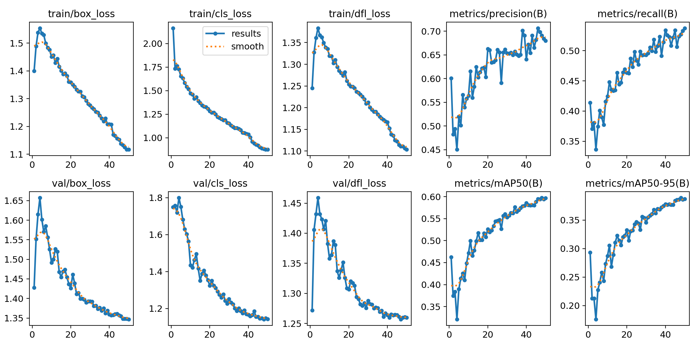
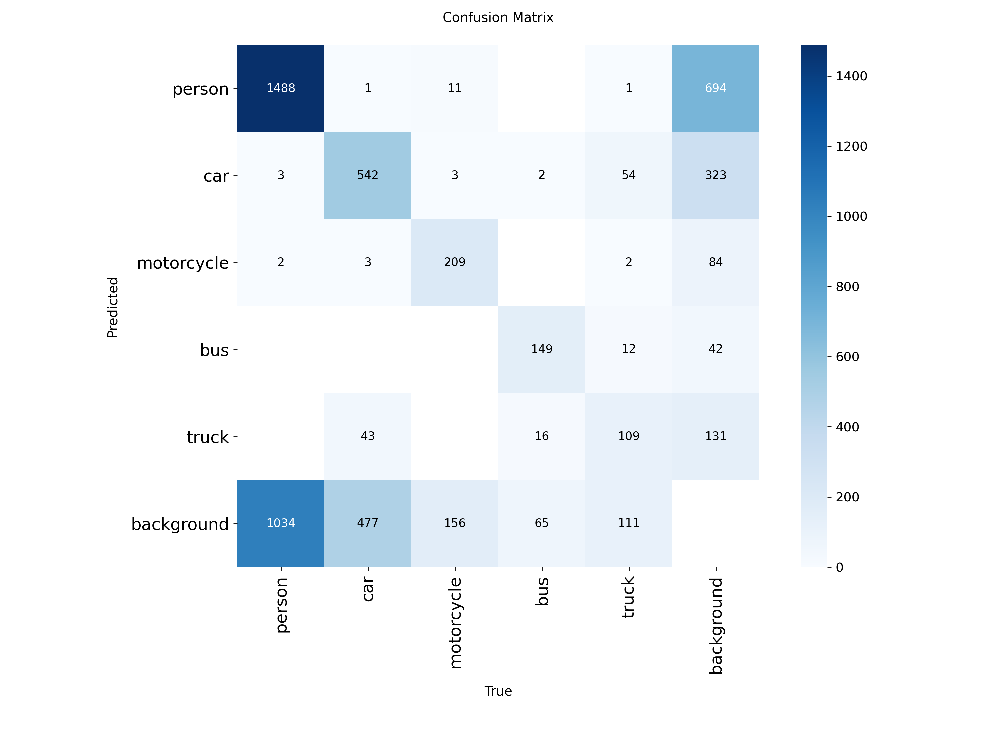
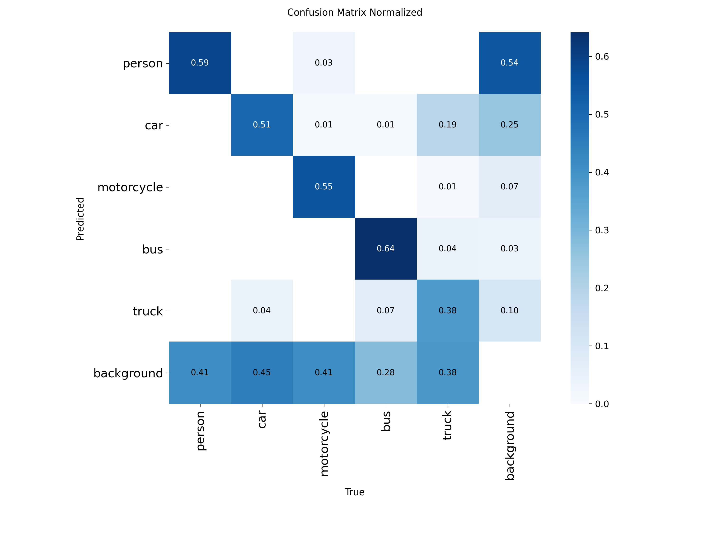
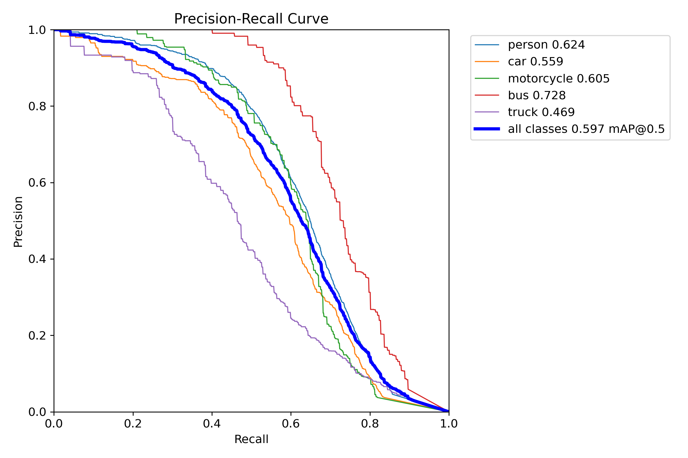
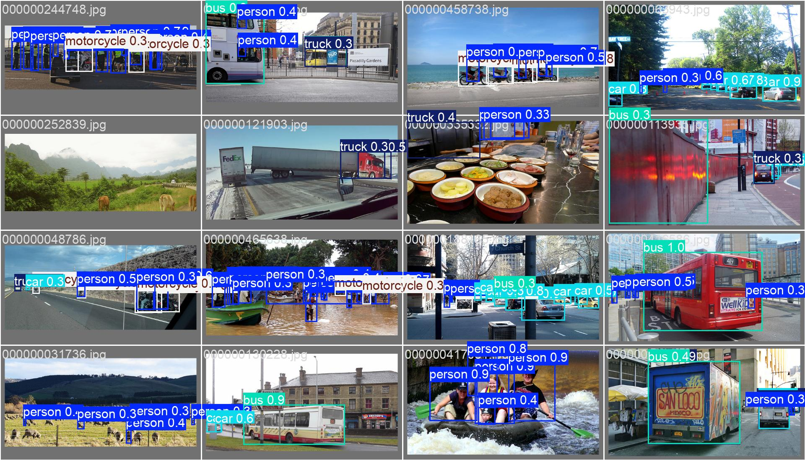
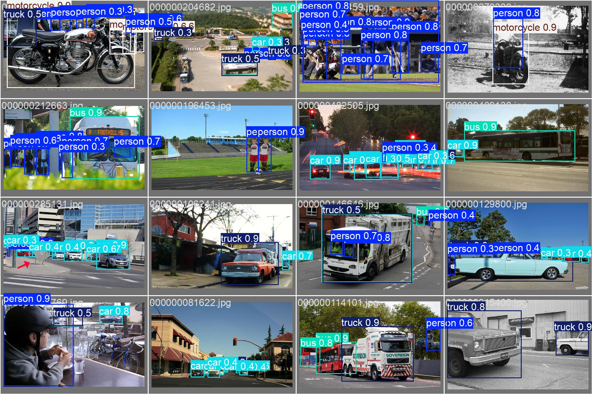
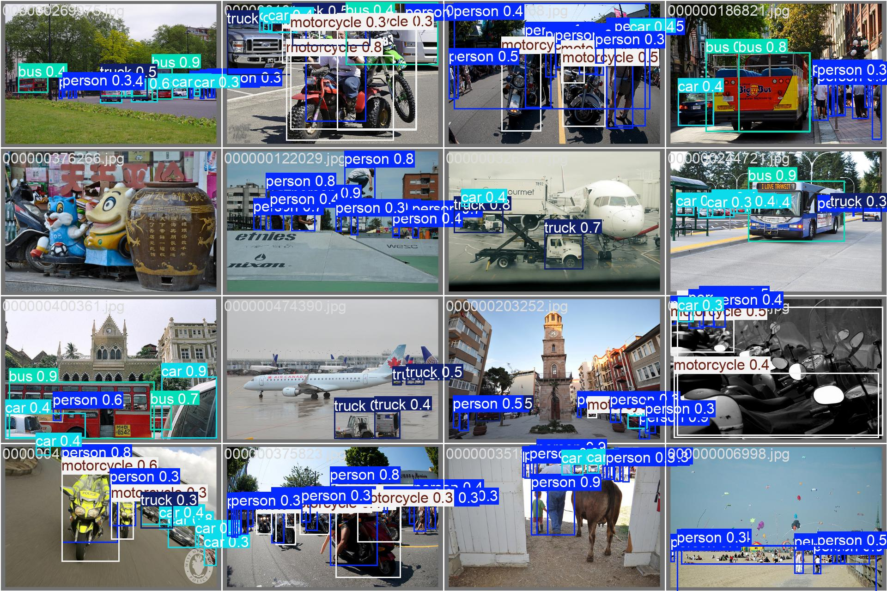

---

# YOLOv8 Object Detection – COCO Subset 3K

End-to-end Object Detection system menggunakan **YOLOv8n** yang di-fine-tune pada COCO subset (~3.000 images, 5 classes) dan dikemas sebagai REST API menggunakan FastAPI + Docker.

---

#  Model Overview

**Architecture**: YOLOv8n (Nano)
**Dataset**: COCO Subset (~3.000 images)
**Classes (5)**:

* person
* car
* motorcycle
* bus
* truck

---

## Training Configuration

* Epochs: 50
* Batch Size: 16
* Image Size: 640
* Learning Rate: 0.003
* Device: GPU (CUDA)
* Seed: 42

Model dilatih menggunakan pretrained YOLOv8n weights dengan fine-tuning pada subset terkurasi.

---

#  Model Performance

## Training Metrics

<p align="center">
  
</p>

---

## Confusion Matrix

<p align="center">
  
  
</p>

---

## Precision–Recall Curve

<p align="center">
  
</p>

---

#  Sample Inference

<p align="center">
  
  
  
</p>

---

# Docker Deployment

Project menyediakan dua mode deployment:

* ✅ GPU (CUDA)
* ✅ CPU

---

##  Build GPU Version

```bash
docker build -f Dockerfile.gpu -t yolov8-api:gpu .
```

### Run (GPU Required)

Pastikan sudah install:

```
nvidia-container-toolkit
```

Jalankan:

```bash
docker run --gpus all -p 8000:8000 --rm yolov8-api:gpu
```

---

##  Build CPU Version

```bash
docker build -f Dockerfile.cpu -t yolov8-api:cpu .
```

### Run (CPU Mode)

```bash
docker run -p 8000:8000 --rm yolov8-api:cpu
```

---

#  REST API

### Health Check

```bash
curl http://localhost:8000/
```

Response:

```json
{
  "status": "ok",
  "device": "0"
}
```

---

### Inference via CURL

```bash
curl -X POST http://localhost:8000/predict \
  -F "file=@test.jpg"
```

Example Response:

```json
{
  "num_detections": 2,
  "detections": [
    {
      "class_id": 0,
      "class_name": "person",
      "confidence": 0.91,
      "bbox": [120.3, 55.1, 300.2, 420.5]
    }
  ]
}
```

---

#  Project Structure

```
.
├── app.py
├── Dockerfile.cpu
├── Dockerfile.gpu
├── notebook/
├── requirements.txt
└── yolov8-coco-subset-3k/
```

---
